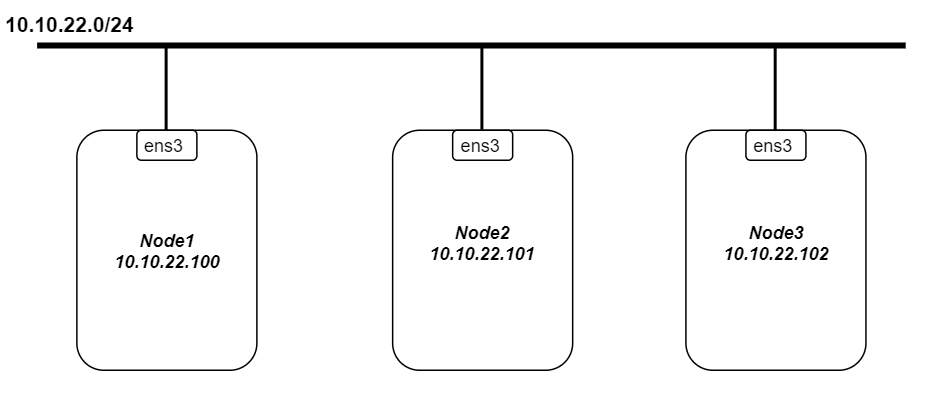
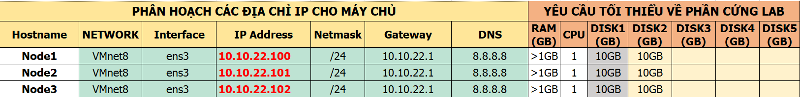

# Cấu hình Galera 3 node trên CentOS 8.

MariaDB Galera Cluster là giải pháp sao chép đồng bộ nâng cao tính sẵn sàng cho MariaDB. Galera hỗ trợ chế độ Active-Active tức có thể truy cập, ghi dữ liệu đồng thời trên tất các node MariaDB thuộc Galera Cluster.
Trước tiên máy phải được cài đặt mariadb. Bạn có thể xem tài liệu cài đặt tại [đây](https://news.cloud365.vn/centos-8-huong-dan-cai-dat-lamp-stack-tren-centos-8/)

## 1. Mô hình chuẩn bị.

## 2. IP Planning.

## 3. Cấu hình.
### Trên node1.

