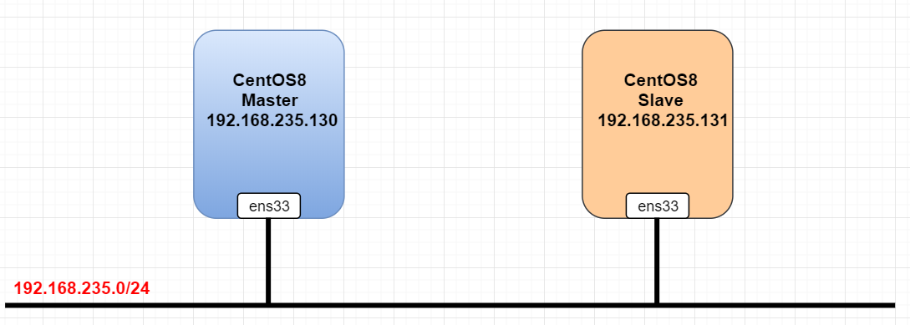

# Thiết lập MariaDB Master-Slave Replication trên CentOS 8. 


## I. Mô hình 




## II. IP planing 


## III. Các bước cấu hình.

### B1. Cài đặt MariaDB và thiết lập mật khẩu cho Master server và Slave server.

Các bạn có thể xem cách cài đặt ở [đây](../../Service/docs/MariaDB_on_CentOS8.md)

### Bước 2: Cấu hình Master Node  

- Cấu hình firewall, cho phép lắng nghe port 3306  

    ```sh
      # firewall-cmd --add-port=3306/tcp --zone=public --permanent
    success
    ```

- Reload xác nhận cấu hình  

    ```sh
      # firewall-cmd --reload
    success
    ```

- Chỉnh sửa file `/etc/my.cnf`  

    ```sh
      # vi /etc/my.cnf
    ```

    Trong phần `[mysqld]` thêm các dòng sau:

    ```sh
      server_id=1
      log-bin=master
      binlog-format=row
      binlog-do-db=replica_db
    ```

    Trong đó:  
    `server_id` là tùy chọn được sử dụng trong replication cho phép master server và slave server có thể nhận dạng lẫn nhau. Server_id Với mỗi server là khác nhau, nhận giá trị từ 1 đến 4294967295(mariadb >=10.2.2) và 0 đến 4294967295(mariadb =<10.2.1)  
    `log-bin` hay `log-basename` là tên cơ sở nhật ký nhị phân để tạo tên tệp nhật ký nhị phân. 
    `binlog-format` là định dạng dữ liệu được lưu trong file bin log.  
    `binlog-do-db` là tùy chọn để nhận biết cơ sở dữ liệu nào sẽ được replication. Nếu muốn replication nhiều CSDL, bạn phải viết lại tùy chọn binlog-do-db nhiều lần.  

- Restart lại dịch vụ mariadb để nhận cấu hình mới

    ```sh
      # systemctl restart mariadb
    ```

- Sử dụng root user đăng nhập vào MariaDB  

    ```sh
      # mysql -u root -p
    ```

- Tạo CSDL có tên là `replica_db`  

      ```sh
        > create database replica_db;
      Query OK, 1 row affected (0.002 sec)
      ```  

- Tạo Slave user, password và gán quyền cho user đó. Ví dụ sử dụng username là `slave_user` và password là `oanh1234!`  

      ```sh
        > create user 'slave_user'@'%' identified by 'oanh1234!';
        > stop slave;
      Query OK, 0 rows affected, 1 warning (0.062 sec)
        > GRANT REPLICATION SLAVE ON *.* TO 'slave_user'@'%' IDENTIFIED BY 'oanh1234!';
      Query OK, 0 rows affected (0.061 sec)
      ```

- Xác nhận lại các thay đổi với câu lệnh:  
      
      ```sh
        > FLUSH PRIVILEGES;
      Query OK, 0 rows affected (0.012 sec)
      ```  
- Sử dụng câu lệnh dưới đây để chắc chắn rằng không có bất cứ điều gì được ghi vào master database trong quá trình replication dữ liệu. Ghi nhớ `filename` and `position` của `binary log` để có thể thực hiện cấu hình trên slave.  

```sh
 > FLUSH TABLES WITH READ LOCK;
```  
- Sử dụng câu lệnh dưới để kiểm tra trạng thái của slave  

      ```sh
        > show master status;
      +--------------------+----------+--------------+------------------+
      | File               | Position | Binlog_Do_DB | Binlog_Ignore_DB |
      +--------------------+----------+--------------+------------------+
      | mariadb-bin.000001 |     2088 | replica_db   |                  |
      +--------------------+----------+--------------+------------------+
      1 row in set (0.058 sec)
      ```  
- Tiến hành `backup` CSDL trên master server và chuyển nó đến slave server  

  ```sh
    # mysqldump --all-databases --user=root --password --master-data > masterdatabase.sql
    Enter password:
    # ls
    anaconda-ks.cfg  masterdatabase.sql  
  ```  

- Đăng nhập vào MariaDB với root user và thực hiện unlock table bằng lệnh  

    ```sh
      > UNLOCK TABLES;
    ```  

- Copy `masterdatabase.sql` file tới Slave server 

    ```sh
      # scp masterdatabase.sql root@192.168.235.131:/root/replica
    ``` 

### Bước 3: Cấu hình Slave Server  

- Chỉnh sửa `/etc/my.cnf` file

    ```sh
      # vi /etc/my.cnf
    ```

    Sau đó thêm vào các dòng sau

    ```sh
    [mysqld]
    server-id = 2
    replicate-do-db=replica_db
    ```    

    Trong đó:  
      `replicate-do-db` là CSDL được tạo trên Master Server  
      `server-id` là tùy chọn được sử dụng trong replication cho phép master server và slave server có thể nhận dạng lẫn nhau. Server_id Với mỗi server là khác nhau, nhận giá trị từ 1 đến 4294967295(mariadb >=10.2.2) và 0 đến 4294967295(mariadb =<10.2.1). 

- Import CSDL master  

    ```sh
      # mysql -u root -p < /root/replica
    Enter password:
    ```  

- Restart MariaDB service để tiếp nhận thay đổi  

    ```sh
      # systemctl restart mariadb
    ```  

- Sử dụng root user đăng nhập vào MariaDB Server  

    ```sh
      # mysql -u root -p
    ```  

- Stop Slave. Sau đó hướng dẫn Slave tìm file `Master Log file` và bắt đầu Slave.  

    ```sh
      > STOP SLAVE;
    Query OK, 0 rows affected (0.012 sec)
      > CHANGE MASTER TO MASTER_HOST='192.168.235.130', MASTER_USER='slave_user', MASTER_PASSWORD='oanh1234!', MASTER_LOG_FILE='mariadb-bin.000001', MASTER_LOG_POS=2088;
    Query OK, 0 rows affected (0.051 sec)
      > START SLAVE;
    Query OK, 0 rows affected (0.044 sec)
    ```  

- Kiểm tra trạng thái của Slave, sử dụng lệnh:  

    ```sh
      > show slave status\G;
    ```

### Bước 4: Kiểm tra


Tài liệu tìm hiểu: 

- https://www.journaldev.com/29314/set-up-mariadb-master-slave-replication-centos
- https://github.com/thuyhiend/thuctapsinh/blob/master/HienNT/Linux/docs/LAMP/MariaDB/Mo_Hinh/master_slave.md
- https://dba.stackexchange.com/questions/73467/mysql-replication-on-windows-server
- https://www.youtube.com/watch?v=DmQWcU2INqQ

