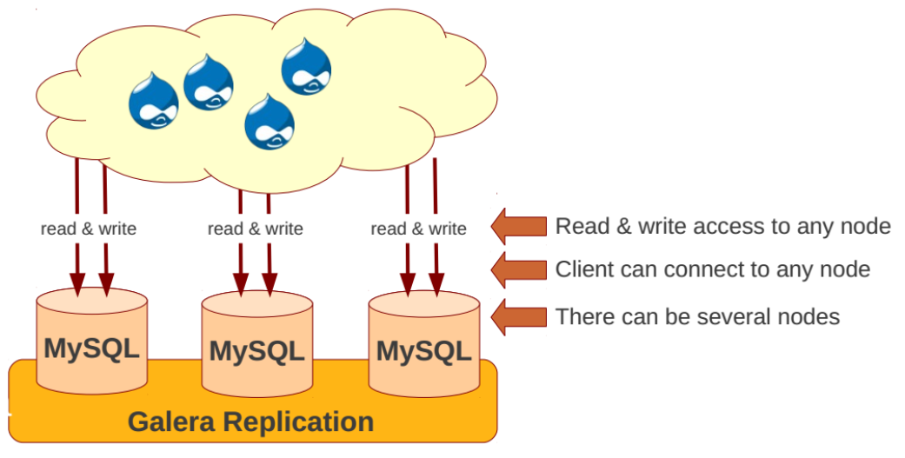

# Tìm hiểu về MariaDB Galera Cluster.

## Mô hình.

## 1. Giới thiệu về galera cluster.

Galera Cluster là một giải pháp multi master cho database. Sử dụng galera cluster, application có thể read/write trên bất cứ node nào. Có thể thêm hoặc gỡ một node ra khỏi cluster mà không có downtime dịch vụ.

Bản thân các database như mariadb không có tính năng multi master được tích hợp sẵn bên trong. Các database này sẽ sử dụng một galera replication plugin để sử dụng tính năng multi master do galera cluster cung cấp. Về bản chất, galera replication plugin sử dụng một phiên bản mở rộng của mysql replication api, bản mở rộng này có tên là `wsrep api`.

- API là các phương thức, giao thức kết nối với các thư viện và ứng dụng khác. Nó là viết tắt của Application Programming Interface.
- Wsrep API: wsrep (viết tắt của Write Set Replication) là một nỗ lực để nghiên cứu và phát triển API sao chép có thể cắm chung cho các ứng dụng giống như DBMS. Nó nhằm mục đích cung cấp giao diện tối thiểu, nhưng đầy đủ và linh hoạt, sẽ đáp ứng hầu hết nếu không phải tất cả các trường hợp sử dụng sao chép.

Một cụm Galera tối thiểu bao gồm 3 nút và nên chạy với số lượng nút lẻ. Lý do là, nếu có vấn đề khi áp dụng giao dịch trên một nút (ví dụ: sự cố mạng hoặc máy trở nên không phản hồi), hai nút khác sẽ có một đại biểu (tức là đa số) và sẽ có thể tiến hành giao dịch cam kết.

## 2. Đặc trưng của galera cluster

Nhân rộng đồng bộ.
- Cấu trúc liên kết đa chủ động tích cực.
- Đọc và ghi vào bất kỳ nút cụm.
- Kiểm soát thành viên tự động, các nút thất bại thả từ cụm.
- Tham gia nút tự động.
- Nhân rộng song song thực sự, trên cấp độ .
- Kết nối máy khách trực tiếp, giao diện MariaDB bản địa.

## 3. Ưu điểm.

Các tính năng trên mang lại một số ưu điểm cho giải pháp phân cụm DBMS (Database Management System), bao gồm:
- Một giải pháp multi master hoàn chỉnh nên cho phép read/write trên node bất kỳ
- Nhân rộng đồng bộ.
- Multi thread slave cho phép apply writeset nhanh hơn
- Không cần failover vì node nào cũng là master rồi.
- Cung cấp nút tự động: Bản thân hệ database đã tự backup cho nhau. Tuy nhiên, khả năng backup tự nhiên của galera cluster không loại trừ được các sự cố do con người gây ra như xóa nhầm data.
- Hỗ trợ innodb.
- Hoàn toàn trong suốt với application nên application không cần sửa đổi gì
- Không có Single point of failure vì bất cứ node nào trong hệ cluster cũng là master.

## 4. Hạn chế.

- Không scale up về dung lượng. Một galera cluster có ba node thì cả ba node đó cùng có một data giống hệt nhau. Dung lượng lưu trữ của cả cluster sẽ phụ thuộc vào khả năng lưu trữ trên từng node.
- Vẫn có hiện tượng stale data do bất đồng bộ khi apply writeset trên các node.

## 6. Tài liệu tham khảo.

- http://vtechie.com/2016/03/15/mariadb-galera-cluster-centos-7/
- https://techblog.vn/cai-dat-ha-galera-cluster-mariadb-su-dung-maxscale-tren-centos-6
