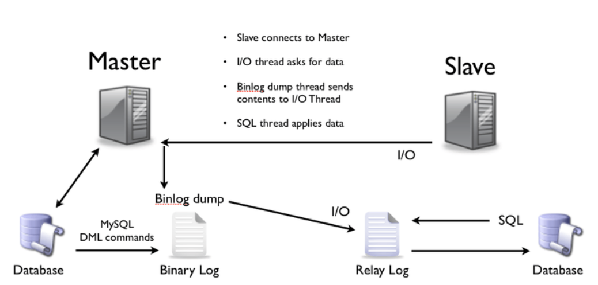

# Tài liệu tìm hiểu về Master Slave.

## Mục lục 

[I. Khái niệm](#khainiem)

[II. Mô hình và cách thức hoạt động](#hoatdong)

[III. Ưu điểm và nhược điểm](#uudiem)

## I. Các khái niệm.

**MySQL Replication:** Server master lưu trữ phiên bản cơ sở dữ liệu phục vụ ứng dụng. Server slave lưu trữ phiên bản cơ sở dữ liệu “nhân bản”. Quá trình nhân bản từ master sang slave gọi là `replication`.

**MySQL Master Slave:** một phiên bản cơ sở dữ liệu giống hệt cơ sở dữ liệu đang tồn tại, và lưu trữ ở một nơi khác, đề phòng có sự cố.

Tất cả các thay đổi trên cơ sở dữ liệu master sẽ được ghi lại dưới dạng `file log binary`, slave đọc file log đó thực hiện những thao tác trong file log, việc ghi, đọc và thực thi trong file log này dưới dạng `binary` được thực hiện rất nhanh.

## II. Mô hình và cách thức hoạt động.

### 1. Mô hình.

### 2. Cách thức hoạt động.

Tại thời điểm hoạt động bình thường mọi request sẽ được đưa đến vào MySQL master. Khi MySQL master gặp sự cố, request sẽ được đẩy cho MySQL Slave xử lý. Khi MySQL master quay lại hoạt động bình thường, request sẽ trả về cho MySQL master.

*Trên Master.* 

- Các kết nối từ web app tới Master DB sẽ mở một `Session_Thread` khi có nhu cầu ghi dữ liệu. `Session_Thread` sẽ ghi các statement SQL vào một file `binlog`. `Binlog` được lưu trữ trong `data_dir `(cấu hình my.cnf) và có thể được cấu hình các thông số như kích thước tối đa bao nhiêu, lưu lại trên server bao nhiêu ngày.

- Master DB sẽ mở một `Dump_Thread` và gửi binlog tới cho I/O_Thread mỗi khi `I/O_Thread` từ Slave DB yêu cầu dữ liệu

*Trên Slave.*

- Trên mỗi Slave DB sẽ mở một `I/O_Thread `kết nối tới Master DB thông qua network, giao thức TCP để yêu cầu `binlog`.

- Sau khi `Dump_Thread` gửi binlog tới` I/O_Thead`, `I/O_Thread` sẽ có nhiệm vụ đọc binlog này và ghi vào `relaylog`.

- Đồng thời trên Slave sẽ mở một `SQL_Thread`, `SQL_Thread` có nhiệm vụ đọc các event từ relaylog và apply các event đó vào Slave => quá trình replication hoàn thành.

## III. Ưu điểm nhược điểm.

### 1. Ưu điểm.

- Giảm tải cho cơ sở dữ liệu trên server master, cải thiệu hiệu năng cho toàn hệ thống.

- Tính bảo mật dữ liệu cao. Vì nó có thể chạy các dịch vụ sao lưu trên các slave mà không làm hư hỏng đến tổng thể tương ứng.

- Tính phân tích - dữ liệu trực tiếp  có thể được tạo ra trên master.

- Phân phối đươc dữ liệu từ xa.

### 2. Nhược điểm.

- Không thể scale out write. Client chỉ có thể ghi data vào một node đóng vai trò master.
- Quá trình failover phải thực hiện bằng tay.

Tài liệu tham khảo:

- https://techblog.vn/gioi-thieu-ve-mysql-replication-master-slave
- https://yen.ypworks.vn/quan-tri-mysql/

