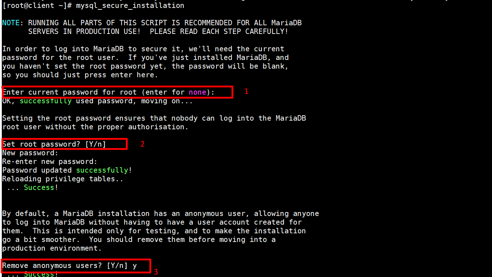
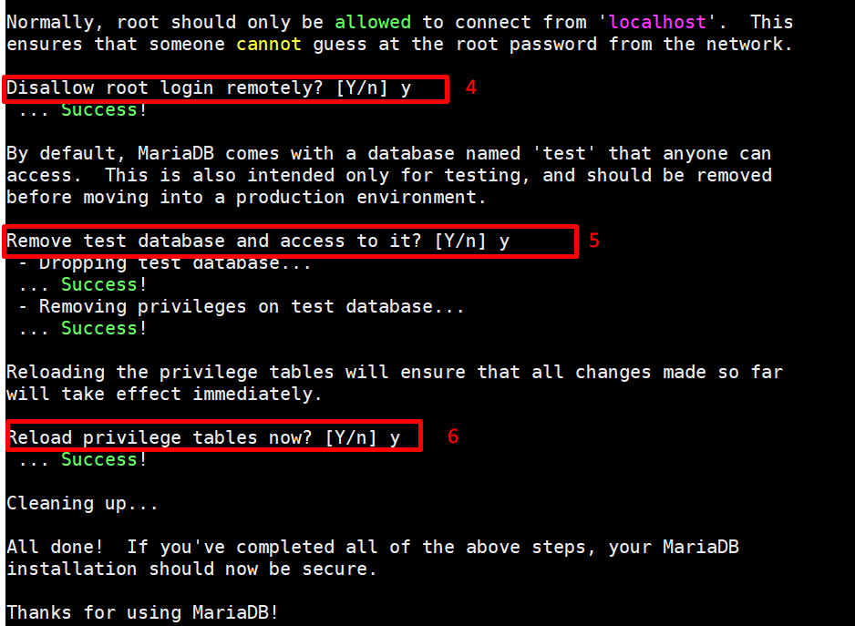

# Cài đặt MariaDB 10.4.8 trên CentOS 8

- **B1 :** Update hệ thống :
    ```
    yum -y update
    yum -y upgrade
    ```
- **B2 :** Cài đặt `galera` :

    ```
    yum install -y galera
    ```
- **B3 :** Disable repo `CentOS-AppStream` :
    ```
    vi /etc/yum.repos.d/CentOS-AppStream.repo
    ```
    - Sửa `enabled=1` thành `enabled=0` :
    ```
    [AppStream]
    name=CentOS-$releasever - AppStream
    mirrorlist=http://mirrorlist.centos.org/?release=$releasever&arch=$basearch&repo=AppStream&infra=$infra
    #baseurl=http://mirror.centos.org/$contentdir/$releasever/AppStream/$basearch/os/
    gpgcheck=1
    enabled=0                
    gpgkey=file:///etc/pki/rpm-gpg/RPM-GPG-KEY-centosofficial
    ```
- **B4 :** Khởi tạo thông tin repository **MariaDB** để chương trình `yum` biết nguồn tải cài đặt **MariaDB** :
    ```
    vi /etc/yum.repos.d/MariaDB.repo
    ```
    - Thêm vào nội dung sau :
        ```
        [mariadb]
        name = MariaDB
        baseurl = http://yum.mariadb.org/10.4.8/centos8-amd64
        gpgkey=http://yum.mariadb.org/RPM-GPG-KEY-MariaDB
        gpgcheck=1
        ```
- **B5 :** Cập nhật lại thông tin các repository :
    ```
    yum repolist
    ```
- **B6 :** Cài đặt **MariaDB** :
    ```
    yum install MariaDB-server MariaDB-client MariaDB-devel -y
    ```
- **B7 :** Khởi động và cấu hình startup cho dịch vụ :
    ```
    systemctl start mariadb.service
    systemctl enable mariadb.service
    ```
- **B8 :** Kiểm tra phiên bản **MariaDB** :
    ```
    mariadbd -V
    ```
    
- **B9 :** Kiểm tra xem tiến trình **MariaDB** có chạy không :
    ```
    ps aux | grep -v "grep" | grep mysql
    ```
    
- **B10 :** Kiểm tra xem dịch vụ có listen port `3306` không :
    ```
    ss -lntp | grep "3306"
    ```
    

- **B11 :** Thiết lập mật khẩu cho user root: 

```
mysql_secure_installation
```





Khi gõ lệnh trên thì trên màn hình sẽ hiển thị những thông tin như trên hình cho chúng ta. Trong đó :

1 : Nếu như ban đầu khi cài mariadb bạn chưa đặt mật khẩu cho user root thì ở đây bạn nhấn Enter.

2 : Máy sẽ hỏi bạn có muốn đặt mật khẩu cho user root không .Ở đây nếu có bặn nhập y

3 : Theo mặc định, bản cài đặt MariaDB có người dùng ẩn danh, cho phép mọi người đăng nhập vào MariaDB mà không cần phải tạo tài khoản người dùng cho họ.Bạn nên remove đi.

4 : Thông thường thì user root chỉ nên kết nối trong localhost.Điều này đảm bảo rằng không ai có thể đoán được mật khẩu qua mạng.Ở đây thông tin nêu ra là "Không cho phép điều khiển root từ xa "

5 : Theo mặc định, MariaDB đi kèm với một cơ sở dữ liệu có tên là 'thử nghiệm' mà bất kỳ ai cũng có thể truy cập. Điều này cũng chỉ dành cho thử nghiệm, và nên được gỡ bỏ.

6 : Tải lại các bảng đặc quyền sẽ đảm bảo rằng tất cả các thay đổi được thực hiện cho đến nay sẽ có hiệu lực ngay lập tức

**B12 :** Đăng nhập và sử dụng MariaDB.

Chúc các bạn thành công!
